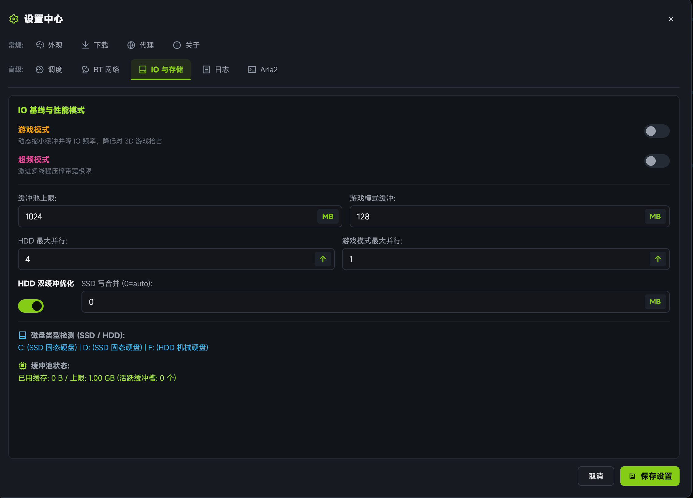

# 磁盘自适应缓冲池机制

高速下载器在千兆/万兆带宽下极易引发磁盘 I/O 阻塞或闪存频繁磨损。limedl 内置了 **自适应缓冲池（Buffer Pool）**，根据存储介质特性智能调度 I/O。

## SSD 模式：写入合并 (Write Combining)

- **避免频繁小文件 I/O**：固态硬盘的擦除块（Block）尺寸较大，频繁微小写入容易加剧写入放大（Write Amplification）。
- **聚合写入策略**：引擎在内存中对连续文件块进行聚合，当缓冲块达到最适配的对齐尺寸（如 1MB~4MB）时统一执行异步落盘，有效延长 SSD 寿命并提升写入吞吐。

## HDD 模式：双缓冲 (Double Buffering)

- **减少寻道抖动**：机械硬盘最忌讳多线程并发下载导致的磁头高频随机寻道。
- **后台平滑刷盘**：采用生产者-消费者双缓冲架构，前台工作线程向缓冲区灌注数据，后台单线程按磁盘物理偏移顺序刷盘，保障机械硬盘不会发生卡死与丢速。

