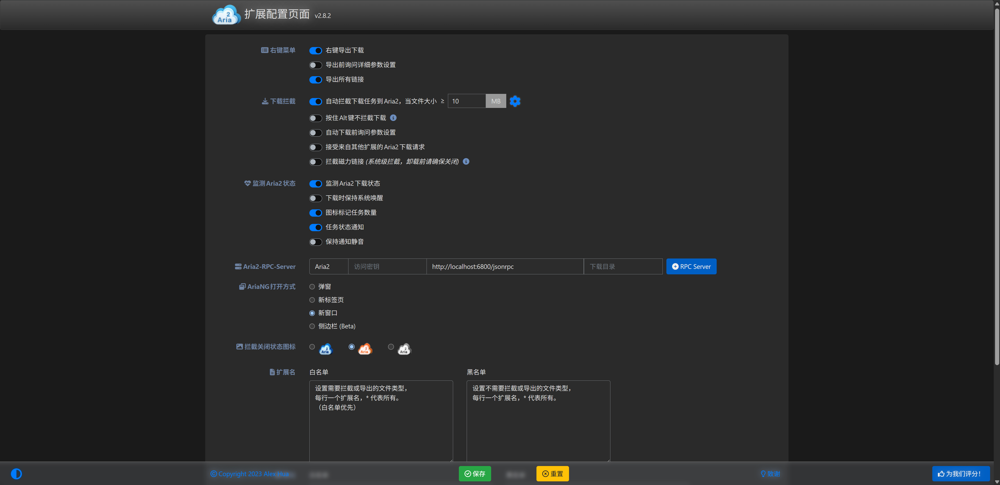

# 浏览器下载接管

借助 limedl 内置的 Aria2 RPC 服务，你可以使用 Chrome、Edge 或 Firefox 上成熟的 Aria2 浏览器扩展，实现**网页点击链接自动调用 limedl 极速下载**。

## 推荐扩展程序

1. **Aria2 Explorer**（推荐，全功能界面与快捷键拦截）
2. **Camtd**（轻量纯净的 Aria2 下载管理器）
3. **网盘下载助手 / 各种油猴脚本 (Tampermonkey)**

## 3 步完成配置

### 步骤 1：确认 limedl RPC 处于开启状态
在 limedl **设置 -> Aria2 RPC** 中，确认：
- **启用 Aria2 RPC**：已勾选
- **RPC 端口**：默认为 `6800`
- **RPC 密钥 (Secret Token)**：默认未设置或按需填写密码

### 步骤 2：安装浏览器扩展
在 Chrome 网上应用店或 Edge 外接程序中搜索并安装 **Aria2 Explorer**。

### 步骤 3：在扩展中填入连接参数
打开扩展的“选项 / 设置”页：
- **主机 (Host)**：`127.0.0.1` 或 `localhost`
- **端口 (Port)**：`6800`
- **协议 (Protocol)**：`WebSocket` 或 `HTTP`
- **密钥 (Secret)**：若 limedl 设置中填写了 Token 则输入，否则留空。

点击“测试连接”，状态显示绿色即表示配置成功！此后在网页中点击任何下载文件，扩展将自动将任务派发至 limedl。

