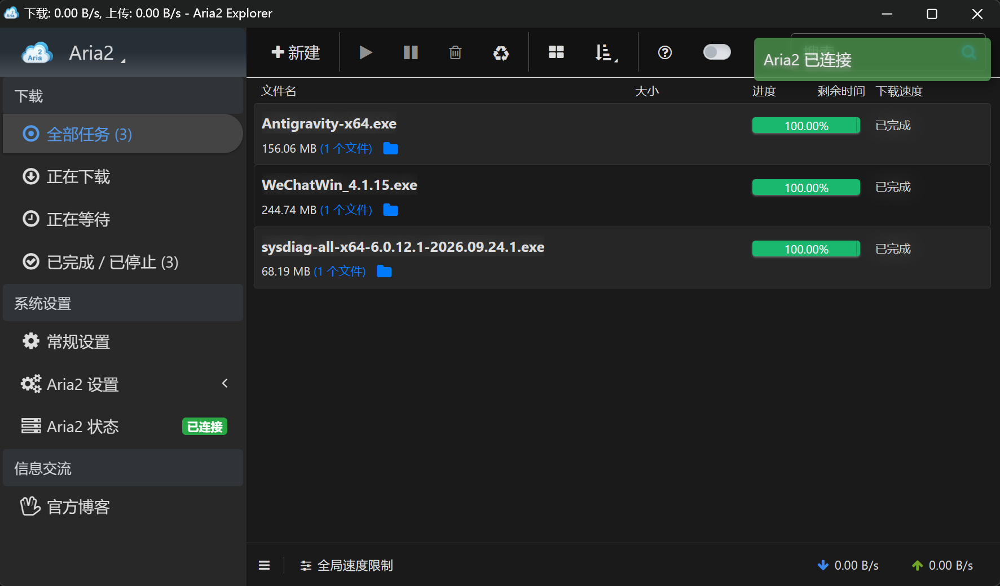

# Aria2 RPC Integration

limedl implements a standards-compliant **Aria2 JSON-RPC 2.0** server, allowing your existing toolchain and automation workflows to interface directly with limedl.

## Supported Methods

- `aria2.addUri([secret], [uris], [options])`: Add HTTP/HTTPS downloads
- `aria2.addTorrent([secret], torrent_base64, [uris], [options])`: Add BitTorrent jobs
- `aria2.getGlobalStat([secret])`: Fetch global bandwidth statistics
- `aria2.tellStatus([secret], gid, [keys])`: Query task progress and chunk details
- `aria2.pause([secret], gid)` / `aria2.unpause([secret], gid)`: Pause/resume tasks
- `aria2.remove([secret], gid)`: Cancel and delete tasks

## Connecting with AriaNg WebUI

For headless setups or LAN remote management:
1. Open any [AriaNg](http://ariang.mayswind.net/) instance.
2. In AriaNg Settings, point the **RPC Host** to the IP of the machine running limedl, with port `6800`.
3. Save and refresh. You now have full web-based remote control of limedl!

