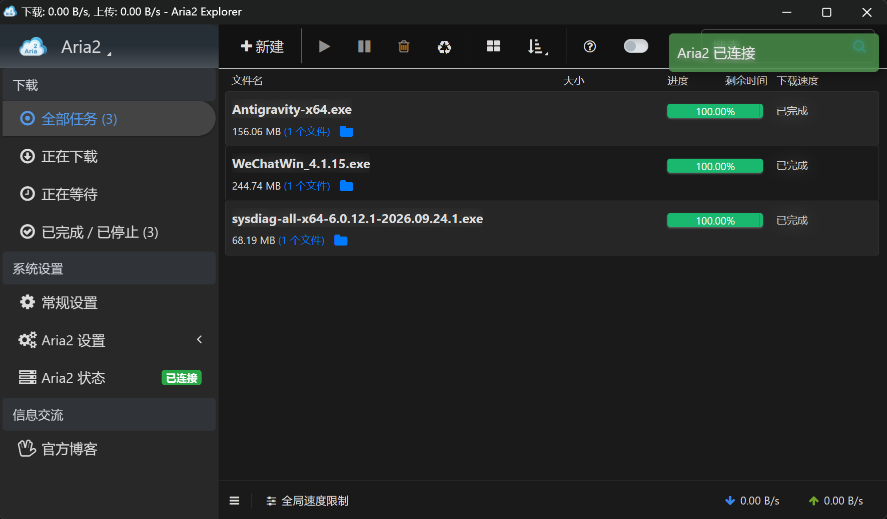

# Aria2 RPC Integration

limedl implements a highly compliant **Aria2 JSON-RPC 2.0** protocol interface. Consequently, existing tools built for Aria2 (such as AriaNg, user scripts, and CLI utilities) work seamlessly with limedl without modifications.

---

## Server Endpoints & Authentication

limedl listens on port `6800` by default, providing both HTTP POST and WebSocket endpoints:

- **HTTP POST**: `http://127.0.0.1:6800/jsonrpc`
- **WebSocket**: `ws://127.0.0.1:6800/jsonrpc`

### Authentication Mechanisms
When a **Secret Token** is enabled in settings, pass it as the first element of the RPC `params` array: `"token:<YOUR_SECRET>"`. Every method requires it (including each layer of `system.multicall`; nested calls may repeat it).

> limedl does **not** support RPC authentication through the HTTP `Authorization` header (neither does aria2); an `Authorization` entry in the `header` download option only applies to the download request itself.

---

## Supported JSON-RPC 2.0 Methods

### 1. `aria2.addUri` — Add HTTP/HTTPS Download
Queues a new HTTP, HTTPS, or BitTorrent magnet task. Magnet links are routed to the BT backend; a `.torrent` URL is still downloaded as a plain file (use `aria2.addTorrent` for the parsed form).

**Sample Request**:
```json
{
  "jsonrpc": "2.0",
  "id": "req-001",
  "method": "aria2.addUri",
  "params": [
    "token:my_secret_token",
    ["https://example.com/archive.zip"],
    {
      "dir": "/home/user/downloads",
      "out": "renamed_archive.zip",
      "header": ["Cookie: session_id=12345", "Referer: https://example.com/"]
    }
  ]
}
```

**Sample Response**:
```json
{
  "jsonrpc": "2.0",
  "id": "req-001",
  "result": "a1b2c3d4e5f60718"
}
```
*(A 16-character hex GID computed as XXH3(TaskId); it survives restarts)*

---

### 2. `aria2.addTorrent` — Add BitTorrent Task
Submits Base64-encoded `.torrent` file bytes.

**Parameters**:
- `params[0]`: Authentication token (optional)
- `params[1]`: Base64 encoded string of torrent bytes
- `params[2]`: Optional web-seeding URLs
- `params[3]`: Options dictionary

---

### 3. `aria2.getGlobalStat` — Retrieve Global Stats
Fetches real-time global transfer rates and task counts.

**Sample Response**:
```json
{
  "jsonrpc": "2.0",
  "id": "req-002",
  "result": {
    "downloadSpeed": "52428800",
    "uploadSpeed": "1048576",
    "numActive": "3",
    "numWaiting": "2",
    "numStopped": "18"
  }
}
```

---

### 4. `aria2.tellStatus` — Inspect Single Task Status
Queries progress, downloaded byte count, and chunk bitfields.

**Sample Request**:
```json
{
  "jsonrpc": "2.0",
  "id": "req-003",
  "method": "aria2.tellStatus",
  "params": [
    "token:my_secret_token",
    "a1b2c3d4e5f60718",
    ["gid", "status", "totalLength", "completedLength", "downloadSpeed", "files"]
  ]
}
```
The optional third parameter `keys` restricts the returned fields (supported; BT task `files` contain the real file list, indices start at 1).

---

### 5. Task Control Methods

| Method | Parameters | Description |
| :--- | :--- | :--- |
| `aria2.pause` | `([secret], gid)` | Pauses the specified active task. |
| `aria2.unpause` | `([secret], gid)` | Resumes the specified paused task. |
| `aria2.remove` | `([secret], gid)` | Cancels and removes the task. |
| `aria2.tellActive` | `([secret], [keys])` | Returns a list of currently active downloads. |
| `aria2.tellWaiting`| `([secret], offset, num, [keys])` | Returns tasks waiting in the queue. |
| `aria2.tellStopped`| `([secret], offset, num, [keys])` | Returns completed or stopped tasks (including results evicted from memory). |
| `aria2.changeOption` | `([secret], gid, options)` | Changes live task options: `pause`; BT `select-file` / `max-download-limit` / `max-upload-limit`. Other options fail with a clear error. |
| `aria2.removeDownloadResult` | `([secret], gid)` | Removes a single stopped (complete/error/removed) result, keeping its files. |
| `aria2.purgeDownloadResult`| `([secret])` | Clears finished tasks from history. |
| `aria2.getVersion` | `([secret])` | Returns limedl engine version and enabled features. |

---

## Connecting AriaNg Web Dashboard

For web-based or remote administration:

1. Open the hosted [AriaNg Web Dashboard](http://ariang.mayswind.net/) (or your self-hosted Docker instance).
2. Go to **"AriaNg Settings"** in the sidebar, then the **"RPC"** tab.
3. Configure the **Aria2 RPC Address** with your machine's IP, port `6800`, and protocol `WebSocket` or `HTTP`.
4. Enter your secret token under **Aria2 RPC Secret** if configured.
5. Click **"Reload AriaNg"**. Once connected, the top status badge turns green, allowing you to manage limedl downloads directly in the browser!



---

## Code Examples

### 1. cURL Command
```bash
curl -X POST http://127.0.0.1:6800/jsonrpc \
  -H "Content-Type: application/json" \
  -d '{
    "jsonrpc": "2.0",
    "id": "1",
    "method": "aria2.addUri",
    "params": [
      ["https://releases.ubuntu.com/24.04/ubuntu-24.04-desktop-amd64.iso"],
      {"dir": "/Downloads"}
    ]
  }'
```

### 2. Python Script
```python
import requests

payload = {
    "jsonrpc": "2.0",
    "id": "py-client",
    "method": "aria2.addUri",
    "params": [
        ["https://example.com/data.tar.gz"],
        {"out": "custom_filename.tar.gz"}
    ]
}

res = requests.post("http://127.0.0.1:6800/jsonrpc", json=payload)
print("Created GID:", res.json()["result"])
```

### 3. Node.js (Fetch)
```javascript
const res = await fetch('http://127.0.0.1:6800/jsonrpc', {
  method: 'POST',
  headers: { 'Content-Type': 'application/json' },
  body: JSON.stringify({
    jsonrpc: '2.0',
    id: Date.now().toString(),
    method: 'aria2.getGlobalStat',
    params: []
  })
});

const data = await res.json();
console.log('Current Download Speed:', data.result.downloadSpeed, 'B/s');
```
