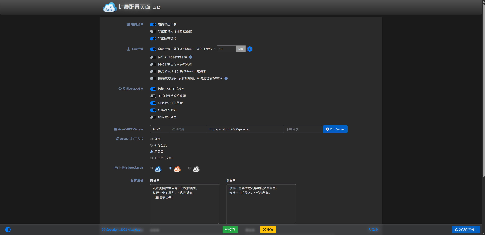

# Browser Download Interception

Default download managers in modern web browsers (Chrome, Edge, Firefox) rely on basic single-stream downloads that fail to saturate modern broadband. Moreover, interrupted downloads cannot easily recover, and browsers lack native support for BitTorrent magnets and torrent files.

Using limedl's built-in **Aria2 JSON-RPC 2.0 server**, you can pair popular browser extensions to **intercept web downloads automatically and launch limedl natively**.

---

## Recommended Browser Extensions

| Extension | Browsers | Highlights |
| :--- | :--- | :--- |
| **Aria2 Explorer** | Chrome / Edge / Firefox | **Highly Recommended**. Feature-packed, supports file extension filters, context-menu interception, shortcut bypasses, and an integrated connection tester. |
| **Camtd** | Chrome / Edge | Minimalist and lightweight, ideal for users who want silent background link dispatching. |
| **Tampermonkey Scripts** | All major browsers | Integrates with cloud-drive download export scripts (Baidu, Quark, 123pan, Alist) to push private files directly to limedl. |

---

## 3-Step Setup Guide

### Step 1: Ensure limedl RPC Server is Active
1. Open the limedl desktop client and click the **Settings** icon in the sidebar;
2. Navigate to the **Aria2 RPC** section:
   - Ensure **Enable Aria2 RPC** is checked;
   - Confirm the **RPC Port** (default is `6800`);
   - Check the **Secret Token**: Leave blank for single-user desktop setups, or set a secure passphrase if desired.

### Step 2: Install the Browser Extension
Install **Aria2 Explorer** from your browser's official store:
- [Chrome Web Store](https://chromewebstore.google.com/detail/aria2-explorer/mpkodccbngfoacfalldjimigbofkhgjn)
- [Microsoft Edge Add-ons](https://microsoftedge.microsoft.com/addons/detail/aria2-explorer/jjfgljkagddikjhjnamjfdhobaomflbe)
- [Firefox Browser Add-ons](https://addons.mozilla.org/firefox/addon/aria2-explorer/)

### Step 3: Configure Connection Parameters
Open the extension's options page:
- **Host**: `127.0.0.1` or `localhost`
- **Port**: `6800` (must match limedl settings)
- **Protocol**: `WebSocket` or `HTTP`
- **Secret**: Enter your secret token if configured in limedl; otherwise, leave blank.



Click **"Test Connection"**. A green light indicating "Connected" confirms that setup is complete!

---

## Interception Tuning & Filter Rules

Fine-tune your interception experience in Aria2 Explorer to avoid capturing trivial files:

### 1. Filter Small Files
- Set the **"Capture File Size Threshold"** to `10 MB` or `20 MB`.
- Small images, PDFs, or text files will download natively within the browser, while large media or archives trigger limedl.

### 2. File Extension Whitelist
Configure target file extensions for automatic capture:
```text
zip, rar, 7z, tar, gz, iso, exe, msi, mp4, mkv, flv, mov, dmg, pkg, deb, rpm
```

### 3. Keyboard Shortcut Overrides
- **Hold `Alt` while clicking a link**: Forces the browser to handle the download natively, bypassing the extension.
- **Hold `Shift` while clicking a link**: Forcefully routes the link to limedl even if the file extension does not match your filter.

---

## Automatic Cookie & Referer Forwarding

Many file-sharing hosts, membership portals, and cloud drives require valid session cookies and referrer headers to permit downloads.

When an extension intercepts a download, it automatically captures the active tab's `Cookie`, `User-Agent`, and `Referer` headers, packing them into the `aria2.addUri` RPC request:
```json
{
  "header": [
    "Cookie: PHPSESSID=xxxxxx; auth_token=yyyyyy",
    "Referer: https://example.com/download-page",
    "User-Agent: Mozilla/5.0 ..."
  ]
}
```
limedl's HTTP engine automatically injects these headers into each parallel range request, guaranteeing that private or session-protected downloads complete without 401 Unauthorized or 403 Forbidden errors.
