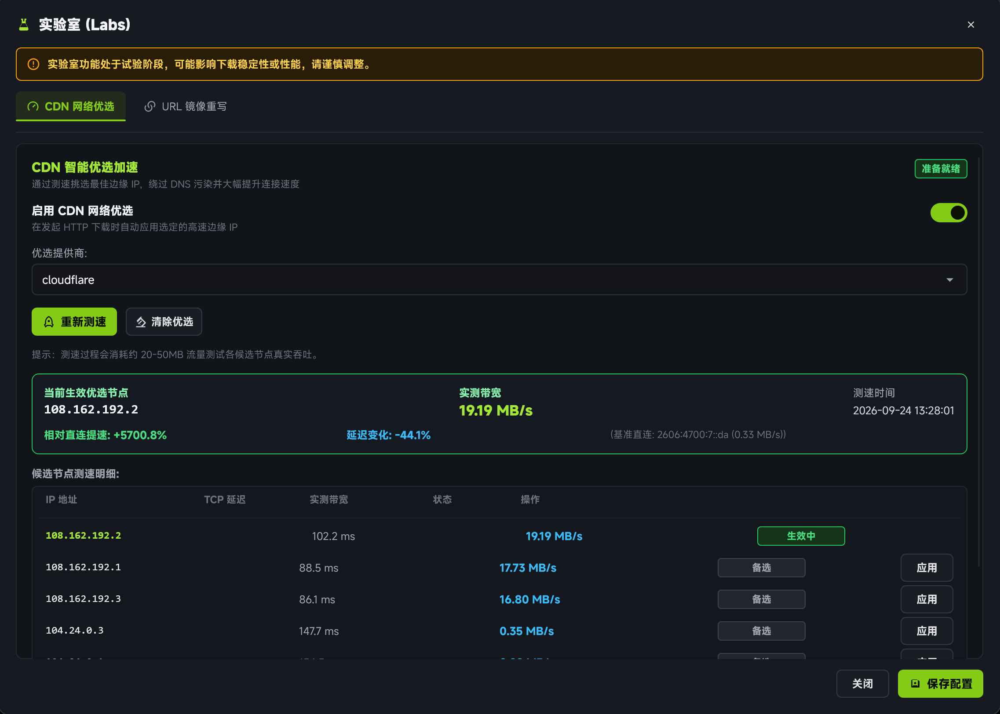

# CDN Acceleration

When downloading from cross-border CDNs or open-source mirrors (such as GitHub Releases or Linux distribution archives), conventional DNS resolvers often route connections to sub-optimal, congested edge nodes.

limedl features a native **CDN Accelerator** that performs low-latency edge IP probing to select the fastest routing path.

## How It Works

1. **Host Recognition**: Detects whether the target URL is hosted on supported CDN networks (e.g. Cloudflare).
2. **Concurrent Edge Probing**: Launches lightweight concurrent TCP/TLS ping tests against candidate edge IPs.
3. **Latency Ranking**: Ranks candidate IP endpoints based on RTT and connection stability.
4. **Transport Layer Rewriting**: Binds the optimal edge IP directly in the Rust HTTP client while preserving proper SNI and Host headers.

## Configuration

In **Settings -> Network & CDN**:
- **Enable CDN Accelerator**: Automatically activates optimization for supported hosts.
- **Custom Candidate IPs**: Advanced users can supply their own tested edge IP lists.

