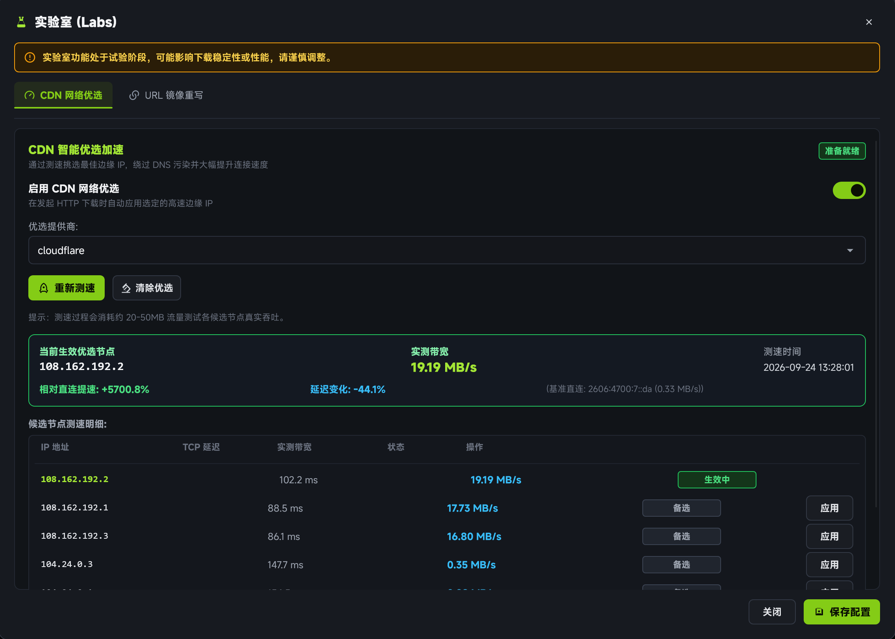

# CDN 探针加速机制

在跨国网络或访问海外开源站点（如 **GitHub Releases**、**HuggingFace 模型权重**、各类 Linux 发行版镜像与开发依赖源）时，传统的下载工具往往遭遇严重的网速瓶颈。

根本原因在于：用户的本地 DNS（Local DNS）受运营商 Anycast 路由策略或 DNS 污染影响，经常将用户导向高延迟、链路丢包严重甚至遭到跨国 QOS 限速的 CDN 边缘节点。

limedl 独创了 **CDN 探针加速系统**，通过并发低延迟筛选与真实的下行吞吐采样，并结合 Rust 网络传输层底层 DNS 重写，实现免代理下的满速极速下载。

---

## 核心工作原理

```
┌─────────────────────────────────────────────────────────────┐
│ 1. 域名识别与特征比对                                         │
│    检测待下载 URL 是否属于 Cloudflare CDN 覆盖的加速域名      │
└──────────────────────────────┬──────────────────────────────┘
                               │
                               ▼
┌─────────────────────────────────────────────────────────────┐
│ 2. 多节点并发轻量筛选 (Screening Phase)                      │
│    向 Cloudflare 官方 IP CIDR 范围发起高并发 TCP/TLS 握手测速  │
│    筛除超时、高抖动节点，留下毫秒级低延迟候选池                │
└──────────────────────────────┬──────────────────────────────┘
                               │
                               ▼
┌─────────────────────────────────────────────────────────────┐
│ 3. 微载荷真实吞吐测速 (Measuring Throughput)                  │
│    对排名前列的候选节点发起小分块下载压力测试                 │
│    计算真实下行吞吐 (MB/s)，选出综合性能最优的边缘 IP          │
└──────────────────────────────┬──────────────────────────────┘
                               │
                               ▼
┌─────────────────────────────────────────────────────────────┐
│ 4. 传输层 DNS 动态重写 (Transport-layer Resolver)            │
│    在 reqwest 客户端内部将目标域名直接映射至选定 IP           │
│    [严格保留原始 TLS SNI 与 Host 头，证书与安全连接完全合法]   │
└─────────────────────────────────────────────────────────────┘
```

### 为什么必须保留原始 SNI 与 Host 头？
很多基于反代或修改 hosts 的工具极易触发 HTTPS 证书无效警告（`Invalid Certificate`）。

limedl 直接在 Rust 的 `reqwest::ClientBuilder::resolve` 传输层接入：
- **网络连接**：直接建立到选定极速 IP 的 TCP Socket 连接；
- **TLS 握手**：向选定 IP 发送目标域名的正规 TLS SNI（Server Name Indication）扩展；
- **HTTP 协议**：附带目标服务器的正规 `Host` 头部。

此机制保证了传输层在享受直连极速的同时，TLS 握手与证书校验 100% 合法，绝不破坏加密安全性。

---

## 在桌面端使用 CDN 探针

### 第一步：进入实验室面板
在 limedl 主界面中，点击左侧导航栏的 **设置** 图标，并切换到 **实验室 (Labs)** 标签页下的 **CDN 加速** 子栏目。



### 第二步：启动智能测速
点击 **“开始测速”** 按钮：
- 客户端后台将启动 `CdnAccelerator` 状态机，自动执行 IP 提取与并发握手；
- 状态机通过 `EventBus` 实时向 UI 回传测速进度；
- 测速完成后，界面将按综合质量由高到低呈现候选 IP 列表，详细标明：**IP 地址**、**往返延迟 (Latency)**、**丢包率** 以及 **实测带宽吞吐 (MB/s)**。

### 第三步：应用优选节点
在列表中找到综合质量最佳的节点（通常带有绿色推荐标识），点击 **“应用该 IP”**：
- 设置将立即生效并原子持久化；
- 后续所有由 limedl 发起的对应 CDN 资源下载，都将自动走该高速边缘节点进行加速。

---

## 自定义优质 IP 列表

针对不同省份、不同运营商（中国电信 / 中国联通 / 中国移动 / 校园网教育网）的网络环境，部分专属 IP 段的表现各不相同。

limedl 允许高级用户维护专属的自定义 IP 列表：
1. 在实验室面板中，切换至 **“自定义 IP 池”**；
2. 输入由第三方测速工具（如 CloudflareSpeedTest）筛选出的洁净 IP，支持单 IP 格式或 CIDR 网段格式：
   ```text
   104.16.24.1
   104.18.32.10
   162.159.130.0/24
   ```
3. 保存后，CDN 探针将优先基于你的专属候选池进行巡检与轮询绑定。

---

## 配合 URL 重写规则实现极限加速

在 **实验室 -> URL 重写** 中，limedl 还支持利用正则表达式对下载链接进行动态改写。

### 经典用例：GitHub Releases 镜像分流
许多国内用户在下载 GitHub Release 资产文件（如大型开源模型、安装包）时遭遇速度极慢或连接中断。

你可以添加一条正则重写规则：
- **匹配模式 (Regex Pattern)**：
  ```regex
  ^https://github\.com/([^/]+)/([^/]+)/releases/download/(.+)$
  ```
- **重写目标 (Replacement)**：
  ```text
  https://mirror.ghproxy.com/https://github.com/$1/$2/releases/download/$3
  ```

保存规则后，当你通过剪贴板或浏览器插件提交原始 GitHub 链接时，limedl 会在派发前自动将其匹配并重写为高速镜像源，同时保留原始文件的校验和与元数据。
